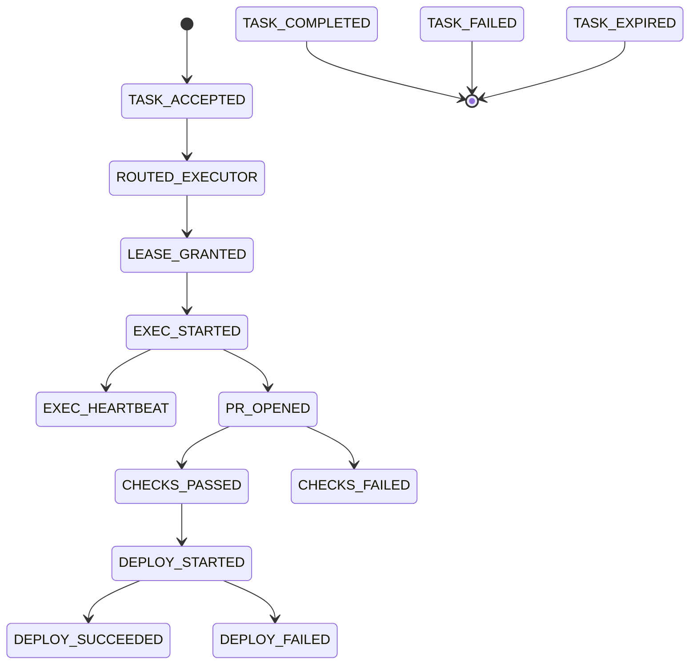

# Event Taxonomy v1.0

## Common Event Header
- `event_id`, `run_id`, `event_type`, `tenant`, `occurred_at`, `producer`, `signature`, `trace_id`, `span_id`, `version`.

## Event Types
- `TASK_ACCEPTED`
- `ROUTED_EXECUTOR`
- `LEASE_GRANTED`
- `EXEC_STARTED`
- `EXEC_HEARTBEAT`
- `PR_OPENED`
- `CHECKS_PASSED` | `CHECKS_FAILED`
- `DEPLOY_STARTED`
- `DEPLOY_SUCCEEDED` | `DEPLOY_FAILED`
- `TASK_COMPLETED`
- `TASK_FAILED`
- `LEASE_EXPIRED`
- `TASK_EXPIRED`
- `BUDGET_EXCEEDED`

## State Machine

## Timing
Heartbeat late if now > last_heartbeat + 1.5 * heartbeat_s.

Lease expires at 2 * heartbeat_s.

**Approved by: ____________ (name/date)**
